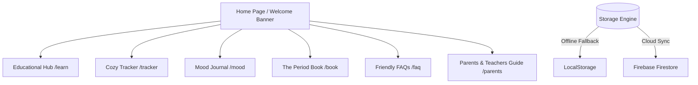

# 🌸 YouAreOkay — Menstrual Education & Comfort Space

> A private, safe, and friendly space for young girls aged 10-15 to understand their bodies, track their cycles stress-free, and feel supported through puberty.

---

## 📖 Overview

**YouAreOkay** is a dedicated educational and self-care platform designed to support young individuals during their transition into puberty. Created with a focus on privacy, safety, and visual comfort, the platform avoids cold, clinical, or overly complex interfaces. Instead, it offers a warm, magazine-like aesthetic with soft colors, gentle animations, and comforting, relatable messaging to make learning about menstruation a beautiful and positive journey.

### 🌟 Project Mission
* **Educate with Clarity:** Demystify puberty and menstruation through simple, engaging, and age-appropriate materials.
* **Track without Anxiety:** Provide a cycle tracker that focuses on ease of use, removing clinical jargon or complex medical math.
* **Support Emotional Health:** Offer a safe space for mood journaling, backed by warm reassurance messages.
* **Empower Parents & Educators:** Provide dedicated tools and guides for adults to start healthy, open conversations about growing up.

---

## 🎨 Design System & Aesthetics

The platform features a highly polished design built to look and feel premium, calming, and state-of-the-art:

### 🎨 Color Palette (Tailwind CSS v4 Theme)
We use a custom-curated, warm color scheme that prioritizes calm and reassuring tones:
* **Background (`--color-cream`):** `#FAF9F6` — A warm, soft off-white that reduces eye strain.
* **Primary Accent (`--color-primary`):** `#9C4A5A` — A comforting deep rose pink for key actions and branding.
* **Secondary Hue (`--color-secondary`):** `#6B5B7B` — A peaceful purple for supportive UI details.
* **Accent Base (`--color-accent`):** `#E2ECE9` — A soft, healing mint/teal.
* **Typography Base (`--color-charcoal`):** `#1F1A19` — Soft dark charcoal for text, avoiding high-contrast black.
* **Bubble Tones:** Pastels (`bubble-pink`, `bubble-purple`, `bubble-teal`, `bubble-yellow`) to highlight different educational and mood sections.

### ✍️ Typography
* **Headers:** `Playfair Display` — A premium, elegant serif font that gives a trustworthy, literary, and editorially curated feel.
* **Body:** `Plus Jakarta Sans` and `Hubot Sans` — Soft, legible geometric sans-serif fonts for clear readability.

### ✨ Interactions & Animations (GSAP)
* **Entry Animations:** Smooth, staggered entry animations for text and interactive cards using GreenSock (GSAP).
* **Ambient Glows:** Continuous, soft breathing background glows that slowly drift, creating a responsive and alive interface.
* **Micro-interactions:** Custom bouncy hover scaling (`bouncy-hover`) and soft transitions (`transition-soft`) on buttons and cards.
* **Celebration effects:** Interactive Canvas Confetti triggers when the user logs their mood in the journal.

---

## 🛠️ Tech Stack

* **Framework:** [Next.js 16 (App Router)](https://nextjs.org/) + [React 19](https://react.dev/)
* **Language:** [TypeScript](https://www.typescriptlang.org/)
* **Styling:** [Tailwind CSS v4](https://tailwindcss.com/) with Custom PostCSS integration
* **Animation:** [GSAP 3.12.5](https://gsap.com/) & [Canvas Confetti](https://www.npmjs.com/package/canvas-confetti)
* **Icons:** [Lucide React](https://lucide.dev/)
* **Auth & DB:** [Firebase Auth & Firestore](https://firebase.google.com/) (Optional Setup) with full LocalStorage fallback for offline capability.

---

## 🧩 Key Modules & Features



### 1. 📚 Educational Hub (`/learn`)
Structured, interactive lessons covering essential topics:
* What periods are and why they happen.
* Step-by-step guides on choosing and using hygiene products (pads, tampons, cups).
* Tips on building healthy routines and practicing physical self-care.

### 2. 📅 Cozy Tracker (`/tracker`)
A stress-free cycle calendar designed to help girls track their periods without anxiety:
* Quick log buttons to mark the start and end of a period.
* Clean visual calendar highlighting current cycle predictions.
* No complicated medical math or charts—just a visual guide of their body's rhythm.

### 3. 💛 Mood Journal (`/mood`)
An interactive, comforting check-in space:
* Simple emotion selection buttons.
* A text area for journaling thoughts.
* Instant, automated reassurance notes written to soothe and uplift based on the user's selected mood.

### 4. 📖 The Period Book (`/book`)
Features 7 friendly, digital chapters from *"The Period Book"*, acting as a personal guide through physical and emotional transformations during puberty.

### 5. 💬 Friendly FAQs (`/faq`)
Straightforward, warm, and supportive answers to questions young girls frequently ask but might feel hesitant to ask out loud.

### 6. 👥 Parent, Guardian & Teacher Guide (`/parents`)
Dedicated resource page providing guidance on how adults can discuss puberty naturally, handle questions constructively, and support young girls effectively.

---

## 🛡️ Privacy, Safety & Offline First

Because **YouAreOkay** is designed for minors (ages 10-15), privacy is paramount:
1. **Fully Anonymous Sessions:** The app utilizes Firebase Anonymous Authentication. No email address, real name, or contact detail is ever required to sign up or use the tracker.
2. **Local-First Fallback:** If Firebase is not configured or the user lacks internet access, the app automatically switches to an offline-first state, saving all credentials, tracking dates, and mood journals directly to the browser's `localStorage`.
3. **No Tracking/Telemetry:** No analytics packages or behavioral trackers are loaded.

---

## 📂 Project Structure

The project follows a modern Next.js src-directory pattern:

```text
menstrualEdu/
├── public/                     # Static assets (fonts, video backgrounds, etc.)
│   ├── HubotSans-VariableFont_wdth,wght.ttf
│   └── 7719713-hd_2048_1080_25fps.mp4
├── src/
│   ├── app/                    # Next.js App Router folders & pages
│   │   ├── book/               # Digital chapters from The Period Book
│   │   ├── faq/                # Frequently Asked Questions
│   │   ├── learn/              # Educational lessons
│   │   ├── mood/               # Mood journal and comfort notes
│   │   ├── parents/            # Guide for parents & educators
│   │   ├── tracker/            # Cycle tracking calendar
│   │   ├── globals.css         # Styling system & Tailwind configurations
│   │   ├── layout.tsx          # Root Layout, fonts, disclaimer, navigation
│   │   └── page.tsx            # Main Landing / Welcome Dashboard
│   ├── components/
│   │   └── Navigation.tsx      # Responsive desktop & mobile navigation bar
│   ├── context/
│   │   └── AuthContext.tsx     # Session management (Anonymous Firebase vs LocalStorage)
│   └── lib/
│   │   └── firebase.ts         # Firebase configuration & initialization script
├── package.json
└── tsconfig.json
```

---

## 🚀 Getting Started

### Prerequisites
* [Node.js](https://nodejs.org/) (v18.x or later recommended)
* npm, yarn, pnpm, or bun

### Installation
1. Clone the repository:
   ```bash
   git clone https://github.com/tarunagnihotri534/LunaLearn.git
   cd LunaLearn
   ```
2. Install dependencies:
   ```bash
   npm install
   ```

### Running the App Locally
Start the local development server:
```bash
npm run dev
```
Open [http://localhost:3000](http://localhost:3000) in your browser to view the application.

### (Optional) Firebase Configuration
To enable cloud sync across devices (via anonymous login saved on Firebase), configure your environment variables:

1. Create a `.env.local` file in the root directory.
2. Add your Firebase project credentials:
   ```env
   NEXT_PUBLIC_FIREBASE_API_KEY=your-api-key
   NEXT_PUBLIC_FIREBASE_AUTH_DOMAIN=your-auth-domain
   NEXT_PUBLIC_FIREBASE_PROJECT_ID=your-project-id
   NEXT_PUBLIC_FIREBASE_STORAGE_BUCKET=your-storage-bucket
   NEXT_PUBLIC_FIREBASE_MESSAGING_SENDER_ID=your-messaging-sender-id
   NEXT_PUBLIC_FIREBASE_APP_ID=your-app-id
   ```
*(Note: If these variables are not present, the application will seamlessly default to LocalStorage fallback mode).*

---

## ⚕️ Medical Disclaimer
**YouAreOkay** is built purely to help young users learn, track their cycle, and find emotional reassurance. **It is not a medical tool and does not provide diagnostic services.** Always encourage young users to talk to a parent, guardian, school nurse, or medical professional if they have questions or concerns regarding their physical health or cycle.
